<!-- @import "[TOC]" {cmd="toc" depthFrom=1 depthTo=6 orderedList=false} -->

<!-- code_chunk_output -->

- [1.Windows中iPhone基本信息获取/软件安装/投屏](#1windows中iphone基本信息获取软件安装投屏)
  - [(1)基本信息获取](#1基本信息获取)
  - [(2)软件安装](#2软件安装)
  - [(3)手机投屏](#3手机投屏)
- [2.越狱设备分析推荐/unC0ver流程详解](#2越狱设备分析推荐unc0ver流程详解)
  - [(1)越狱设备的分析与推荐](#1越狱设备的分析与推荐)
  - [(2)checkra1n越狱详细流程](#2checkra1n越狱详细流程)
    - [（1）制作一个越狱u盘](#1制作一个越狱u盘)
    - [（2）刷入手机实现越狱](#2刷入手机实现越狱)
- [3.越狱后手机常用工具:日志/网络/包管理/免签名](#3越狱后手机常用工具日志网络包管理免签名)
  - [(1)cydia自带源工具安装](#1cydia自带源工具安装)
  - [(2)三方源工具安装](#2三方源工具安装)
- [4.Frida/Objection/任意版本安装切换/动态分析](#4fridaobjection任意版本安装切换动态分析)
  - [(1)安装最新frida](#1安装最新frida)
  - [(2)安装objection](#2安装objection)
- [5.ios砸壳/IPA静态分析基本流程/IDAF5函数定位](#5ios砸壳ipa静态分析基本流程idaf5函数定位)
  - [(1)ios砸壳](#1ios砸壳)
  - [(2)IPA静态分析基本流程及IDAF5函数定位](#2ipa静态分析基本流程及idaf5函数定位)
- [6.linux中iphone手机信息获取:ID/名称/详情/签名/截屏/定位](#6linux中iphone手机信息获取id名称详情签名截屏定位)
  - [(1)获取设备ID](#1获取设备id)
  - [(2)获取设备名称](#2获取设备名称)
  - [(3)获取屏幕截图](#3获取屏幕截图)
  - [(4)设置虚拟定位](#4设置虚拟定位)
  - [(5)获取设备详情](#5获取设备详情)
- [7.安装APP/IPA:安装/卸载/升级/备份/恢复APP](#7安装appipa安装卸载升级备份恢复app)
  - [(1)安装软件](#1安装软件)
  - [(2)卸载软件](#2卸载软件)
  - [(3)查看已安装应用](#3查看已安装应用)
  - [(4)其他](#4其他)
- [8.收发传输文件:usbmuxd OpenSSH=adb pull/push](#8收发传输文件usbmuxd-opensshadb-pullpush)
  - [(1)基于usbmuxd实现adb pull/push](#1基于usbmuxd实现adb-pullpush)
  - [(2)基于OpenSSH实现adb pull/push](#2基于openssh实现adb-pullpush)
- [9.远程文件管理:磁盘映射/电脑上浏览手机文件夹](#9远程文件管理磁盘映射电脑上浏览手机文件夹)
  - [(1)挂载文件系统](#1挂载文件系统)
  - [(2)取消挂载](#2取消挂载)
- [10.升降级和激活:恢复模式/固件升降级/手机激活](#10升降级和激活恢复模式固件升降级手机激活)

<!-- /code_chunk_output -->

# Intro

很多人在学习逆向iOS app的时候，都有两个痛点：

1. iOS设备太贵
2. 需要macOS环境

前者需要小几千的iPhone，后者需要至少大几千的Macbook 。本系列文章就是为了解决这两个痛点，全部操作在一百多块钱的iPhone6上完成，且电脑端在r0env/Win上进行演示，让我们康康，这几乎无成本的一套环境，究竟可以让我们走多远，走多深！

本篇文章是《挑战不用macOS逆向iOS APP》系列的第一课环境搭建主要为了实现在iOS APP逆向过程中一些环境方面的常规需求，具体实现目标如下:
- windows中iPhone基本信息获取/软件安装/投屏
- 越狱设备分析推荐/工具推荐/unC0ver流程详解
- 越狱后手机常用工具:日志/网络/包管理/免签名
- Frida/Objection/任意版本安装切换/动态分析
- ios砸壳/IPA静态分析基本流程/IDAF5函数定位
- linux中iphone手机信息获取:ID/名称/详情/签名/截屏/定位
- 安装APP/IPA:安装/卸载/升级/备份/回复APP
- 收发传输文件:usbmuxd OpenSSH=adb pull/push
- 远程文件管理:磁盘映射/电脑上浏览手机文件夹
- 升降级和激活:恢复模式/固件升降级/手机激活


# 1.Windows中iPhone基本信息获取/软件安装/投屏
## (1)基本信息获取
Windows中操作iPhone官方推荐方式是使用iTunes，但是后续我们会安装未经签名的应用，因此这里我们推荐使用爱思助手进行操作。直接去官网下载安装爱思助手，打开并在手机上信任此电脑
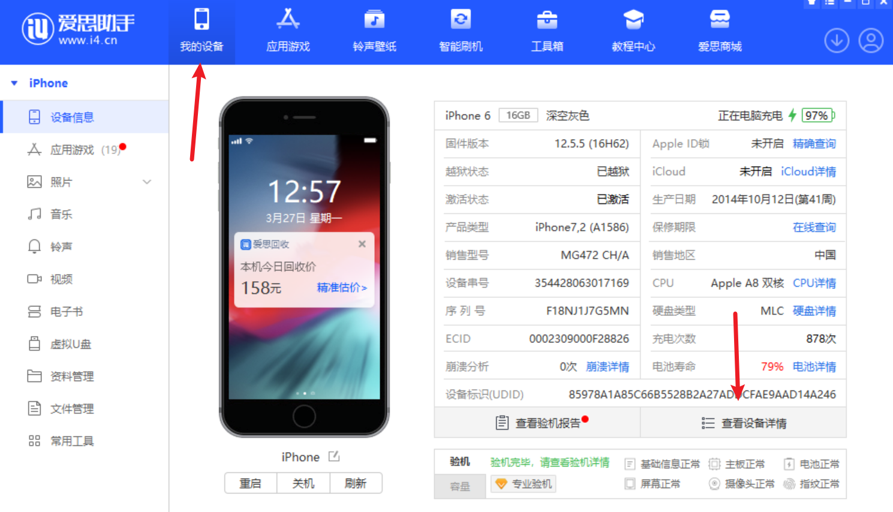


## (2)软件安装

软件安装:点开爱思助手的应用游戏可以直接安装，爱思上安装的软件有APP Store上架的也有未上架但有企业账号签名的，具体内容涉及IPA签名，会在后续文章解释。
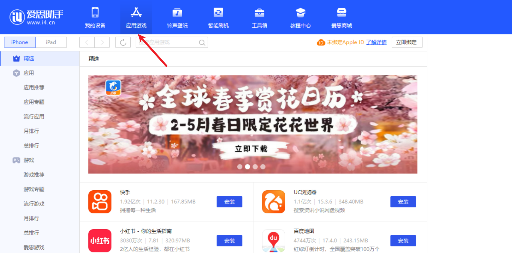

## (3)手机投屏
直接使用爱思助手中的投屏，可以使用有线投屏，同一局域网下也可以使用无线投屏

手机端上滑点击屏幕镜像点击爱思投屏即可。

# 2.越狱设备分析推荐/unC0ver流程详解

## (1)越狱设备的分析与推荐

查看爱思助手的越狱方式可以看到
可以支持ios版本最高的是unc0ver方式可以支持到iOS14.8，而又由于iPhone越狱失败后重启设备失败的话需要恢复出厂设置，此时会自动更新到当前设备支持的最新iOS版本，而iPhone6最高版本是12.5.4，iPhone6s和iPhone7最新版本均是iOS 15，因此我们选择使用iPhone6作为越狱设备，这样即使越狱失败最新版本也依然在越工具支持版本之下。
越狱方式对比，这里主要分析两种方式unc0ver和Checkra1n
checkra1n:比较复杂还要制作u盘但是胜在稳定
unc0ver：过程简单但是成功比较看运气，需尝试多次才能成功

## (2)checkra1n越狱详细流程

### （1）制作一个越狱u盘

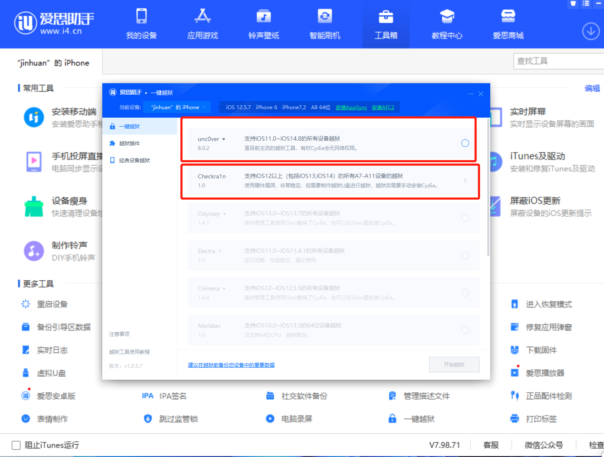
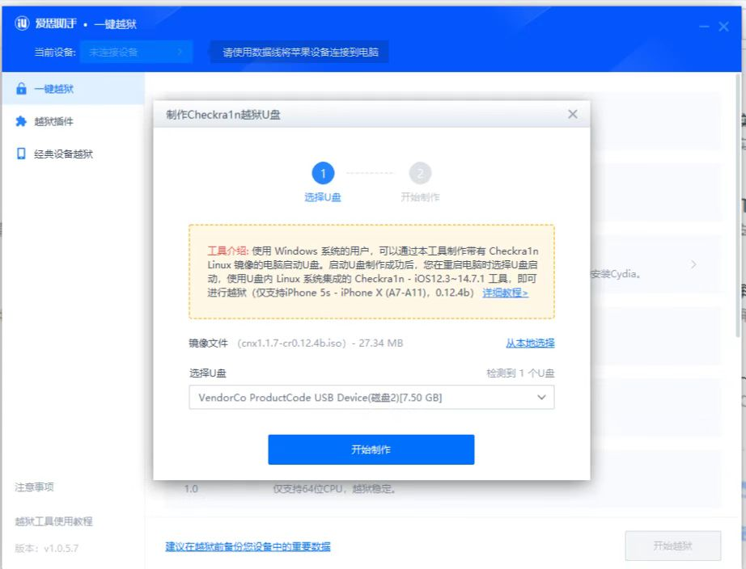


### （2）刷入手机实现越狱

进入电脑BIOS选择VendorCo ProductCode 从u盘启动
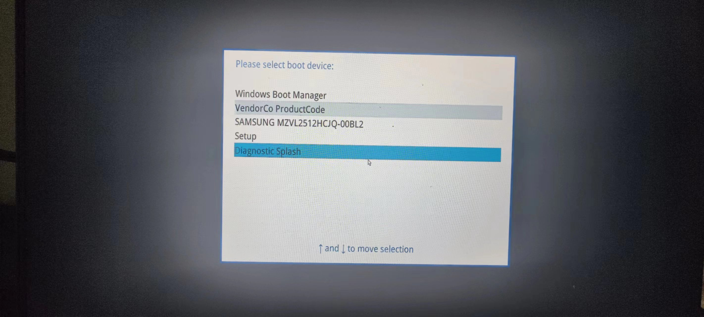
选择ALT+F2进入Checkra1n刷机系统
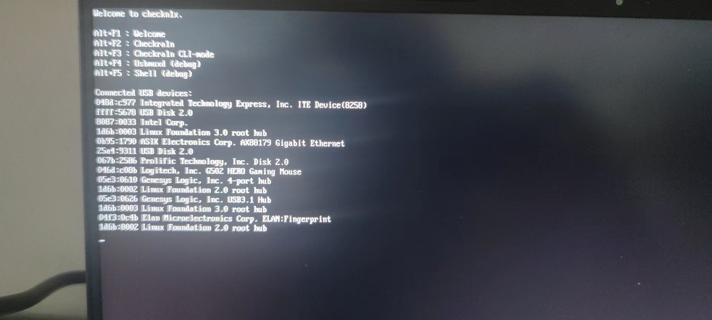
上下左右空格键控制start开始越狱
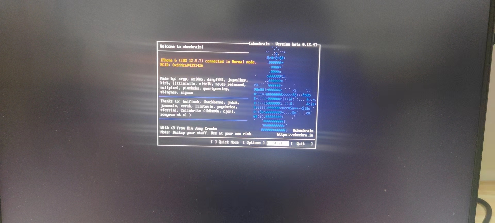
next


进入刷机界面后根据提示操作
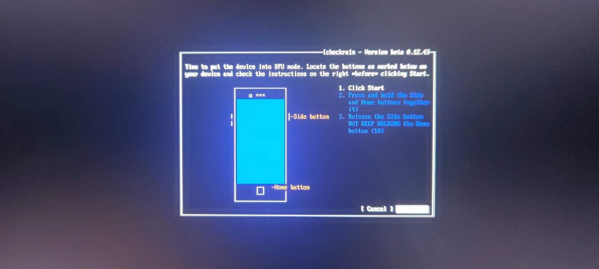
1.点击start
2.同时摁住侧边键和home键
3.摁住home键
这个界面就是在刷入，ALL Done就是刷入成功了。
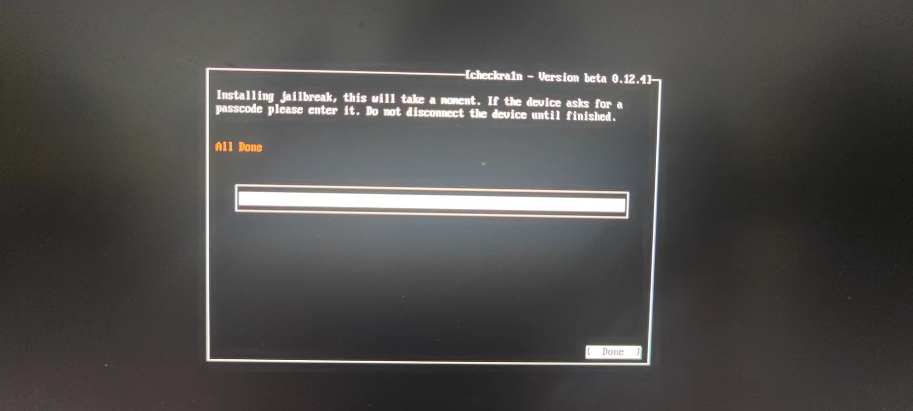
补充：中间可能会失败，没关系多来几次总能成功的，但是一定注意，手机不要买到带锁机，二手iphone卖家有时会隐藏ID锁，这种机子可以登录自己ID但是一旦越狱失败就寄了。。。

# 3.越狱后手机常用工具:日志/网络/包管理/免签名

手机越狱成功后，会在桌面显示checkra1n图标，点击安装cydia，cydia是一个需要越狱后使用的三方软件仓库。这里我们主要安装以下几个工具：
## (1)cydia自带源工具安装
cydia自带源的工具可以直接搜索安装
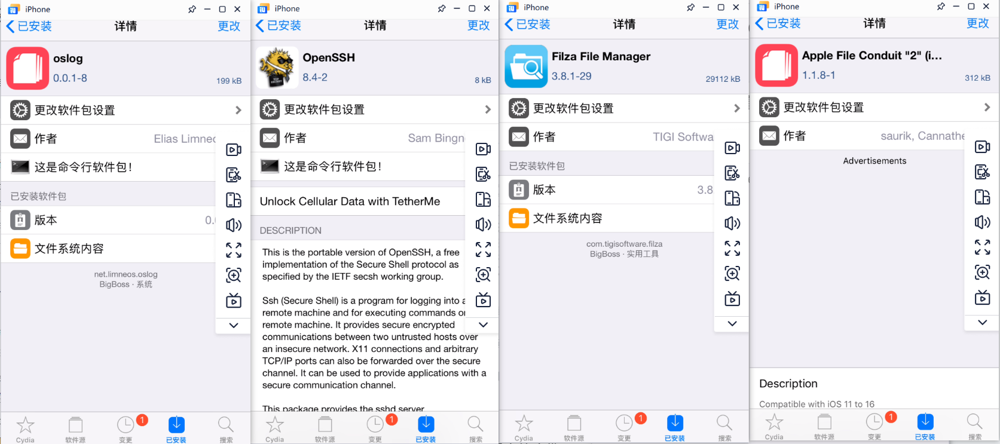

- oslog 日志查看工具，默认安装在/usr/bin目录下
- OPENSSH  					 远程连接软件，作用是远程连接手机,默认账号密码为root/alpine
- Filza File Manager 		是手机端的文件管理软件，作用是让我们更方便的操作手机上的文件。
- Apple File Conduit "2" IOS上的一个插件工具，作用是帮助我们在电脑端操作手机上的文件


## (2)三方源工具安装

- AppSync Unifield         

AppSync Unifield是IOS上的插件工具，作用是帮助我们安装未经苹果签名的IPA,安装后可以安装未经苹果签名的软件，安装具体流程如下：
首先添加源：编辑->添加->输入cydia.angelxwind.net
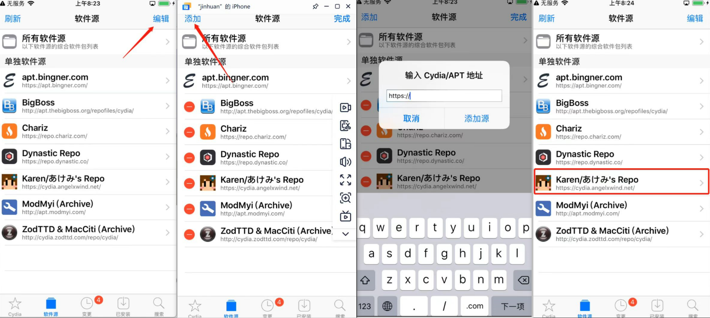

然后进行插件安装：karen->插件->AppSync->安装->确认->重启
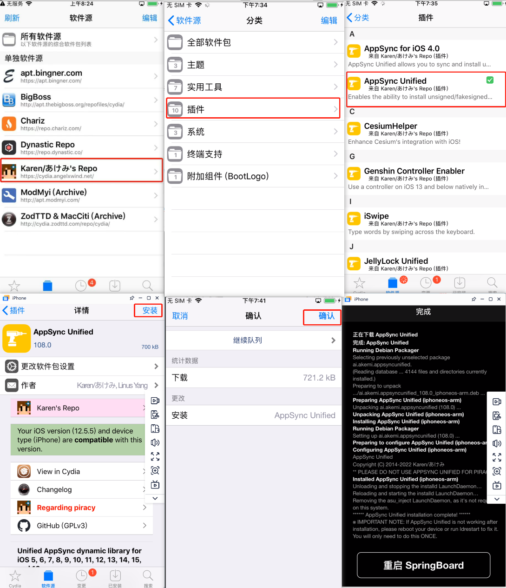

- frida-server


   卸载历史版本
```
dpkg -l | grep frida 匹配已经安装的frida
dpkg -P re.frida.server卸载软件
```
下载最新frida-server进行安装


```
dpkg -i frida_16.0.10_iphoneos-arm.deb 
```
# 4.Frida/Objection/任意版本安装切换/动态分析

这里使用r0env,自带pyenv支持多版本Frida/objection切换，这里安装最新版本作为演示
## (1)安装最新frida
```
pyenv install 3.9.5
pyenv global 3.9.5
pip install frida==16.0.5
```
这里安装的时候不挂代理会很慢，挂代理后遇到了一个错误
 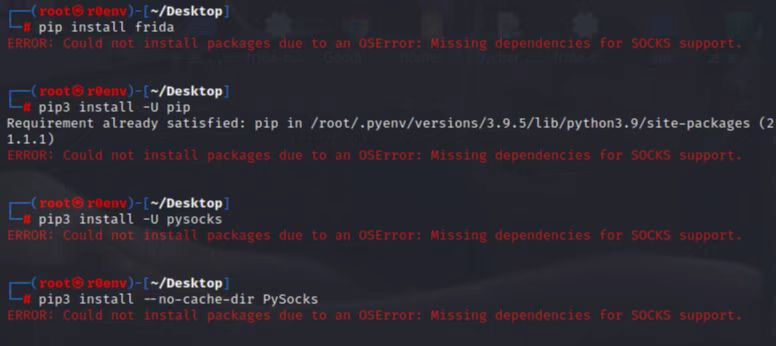
错误原因是没有socks相关库

```
unset ALL_PROXY
pip install pysocks
```

再挂代理安装

```
export ALL_PROXY="socks://代理IP:port"
pip install frida
pip install frida-tools
```
安装成功


## (2)安装objection 
```
pip install objection
objection -g 高考蜂背 explore
```

# 5.ios砸壳/IPA静态分析基本流程/IDAF5函数定位
## (1)ios砸壳
ios砸壳工具也有很多，这里我们推荐使用frida-ios-dump,下边是安装使用详细过程：
```
git clone https://github.com/AloneMonkey/frida-ios-dump
cd frida-ios-dump/
apt-get install usbmuxd
pip install -r requirements.txt --upgrade
iproxy 2222 22
./dump.py 高考蜂背
```
## (2)IPA静态分析基本流程及IDAF5函数定位
因为本篇文章主题是环境搭建，因此这里仅演示简单流程
```
file 高考蜂背.ipa
unzip 高考蜂背.ipa
cd Payload/
cd Gkfb.app/
file * | grep -i mach
ida64 ./Gkfb
```
经过frida-ios-dump砸壳后我们拿到了IPA包对其进行解压，并检索内部mach-o可执行文件，随后用ida分析文件。


分析过程检索发现MD5格式函数，使用F5即可看到其伪代码


# 6.linux中iphone手机信息获取:ID/名称/详情/签名/截屏/定位
在linux中操作iPhone主要使用libimobiledevice库及依赖于它的一些开源工具，这里先下载安装该库
```
apt-get update
add-apt-repository ppa:pmcenery/ppa
apt-get install libimobiledevice-utils
```
下面是该库的一些简单使用:
## (1)获取设备ID

```
idevice_id  获取当前连接设备UUID
```

## (2)获取设备名称
```
idevicename   查看当前连接设备名称
```

## (3)获取屏幕截图
```
idevicescreenshot :从连接的设备获取屏幕截图
```

## (4)设置虚拟定位
```
idevicesetlocation [OPTIONS] -- <LAT> <LONG>根据经纬度模拟定位
idevicesetlocation -- 35.10463 117.193626   山东枣庄
```
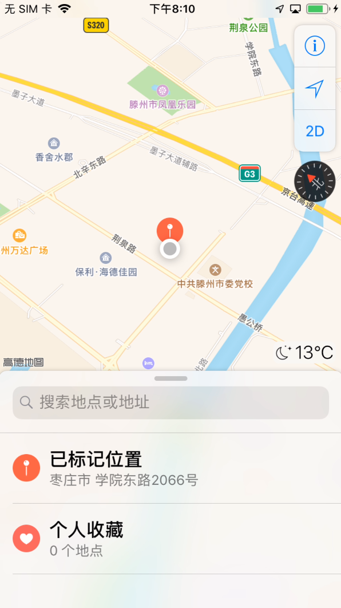
## (5)获取设备详情
```
ideviceinfo :查看手机设备详情列出全部相关信息
```


# 7.安装APP/IPA:安装/卸载/升级/备份/恢复APP
linux上对iPhone中软件操作这里是使用的依赖于libimobiledevice库的工具ideviceinstaller，在安装完libimobiledevice库后我们可以直接使用apt安装该工具
```
apt-get install ideviceinstaller
```
## (1)安装软件

```
ideviceinstaller  -i xxx.ipa 安装软件
```

## (2)卸载软件
```
ideviceinstaller -U [bundleID]卸载应用
```

## (3)查看已安装应用
```
ideviceinstaller -l 查看安装软件
```


## (4)其他

```
ideviceinstaller -g [bundle_id] [path] 根据压缩包升级app
ideviceinstaller -o export -i [bundle_id] -o [PATH] 根据路径备份app
ideviceinstaller -r 从备份中恢复app
```

# 8.收发传输文件:usbmuxd OpenSSH=adb pull/push
usbmuxd是一个苹果提供的通信服务，用于建立通信通道，libimobiledevice库就是基于这个服务实现了许多功能，依赖该库的工具ifuse实现的文件系统挂载自然也是基于此服务，我们可以通过挂载文件系统实现手机端与电脑端的文件传输，从而实现android中adb push/pull的同样效果，我们也还可以通过OpenSSH服务实现文件传输，以下是二者具体实现：
## (1)基于usbmuxd实现adb pull/push
ifuse是依赖libimobiledevice库将iOS设备挂载到本地系统的开源工具,安装完库后直接使用apt安装
```
apt install ifuse
```
```
ifuse --root [挂载点]：越狱后将整个iphone文件系统挂载过来
```

将文件系统挂载过来后我们就可以进行自由的文件传输

## (2)基于OpenSSH实现adb pull/push
OpenSSH在手机中已经安装过，安装后自动开启ssh服务，我们就可以使用linux的scp命令进行文件传输
从本地push到手机
```
scp -P 22 1.txt root@192.168.1.108:/  这里写-P是为了使用一些非标准端口时指定端口
```

从手机pull到本地

```
scp -P 22 root@192.168.1.108:/2.txt ./ 
```

# 9.远程文件管理:磁盘映射/电脑上浏览手机文件夹
ifuse是依赖libimobiledevice库将iOS设备挂载到本地系统的开源工具,安装完库后直接使用apt安装
```
apt install ifuse
```
## (1)挂载文件系统
```
ifuse --root [挂载点]：越狱后将整个iphone文件系统挂载过来
```
 
## (2)取消挂载
```
fusermount -u [挂载点]:卸载挂载点
```

# 10.升降级和激活:恢复模式/固件升降级/手机激活
(1)进入恢复模式
```
ideviceenterrecovery  让设备启动到恢复模式，iOS设备的恢复模式允许用户刷写、升级或还原设备的固件。
```
(2)固件升降级

```
idevicerestore [OPTIONS] PATH 将PATH路径上的固件包安装到ios设备
            -u 指定设备ID
            -l 使用最新可用固件
```
(3)手机激活

```
ideviceactivation activate <activation_record_path>
```
其中，activation_record_path是包含激活记录的文件路径。这个文件可以从其它iPhone上备份，或者从开发人员手中获得。运行后，libimobiledevice将会将激活记录写入到手机中，从而完成激活过程。激活成功后，你的iPhone将可以正常使用。

《挑战不用macOS逆向iOS APP》系列的第一课环境搭建内容到这里就结束了，两百元成本的iOS APP逆向的基本环境已经搭建成功，后续会继续更新iOS App逆向的内容，需要购买设备和全套学习课程的可以私信vx：r0ysue 来下单。
